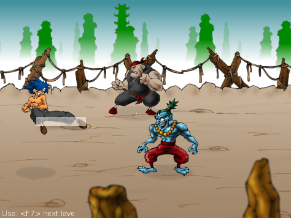

Colisiones
==========

Durante el juego uno puede golpear a los enemigos y
a su vez los enemigos nos pueden golpear. A este
comportamiento se lo denomina colisiones. Y son las
únicas interacciones entre personajes que existen.

CollisionManager
----------------

Hay una instancia de este objeto dentro de ``Stage``, que
a su vez es parte de ``Game``.

``CollisionManager`` se encarga de detectar si los personajes
se estan golpeando o no. Para ello tiene dos listas de personajes, 
una se utiliza para el protagonista y otra para los enemigos.

¿Como se genera un colision?
----------------------------

El objeto ``CollisionManager`` en realidad se actualiza todo
el tiempo buscando atributos en los personajes para determinar
si existen colisiones o no.

Cuando un objeto quiere emitir una colisión tienen que pasar
dos cosas. Una es que el personaje esté en una de
las listas del ``CollisionManager``, cosa que se realiza
con frecuencia cuando se genera el objeto::

    new_enemy = EnemyExample()...
    self.stage.collision_manager.add_enemy(new_enemy)

Lo segundo que tiene que hacer el personaje para emitir una
colisión es llamar al método ``set_collision`` de la clase
``Sprite``:

.. automethod:: sprite.Sprite.set_collision

Este metodo produce un rectángulo que el ``CollisionManager``
va a detectar y con eso va a ver si existe un colisión con
alguien mas.

.. note::
    
    Si quieres que los rectangulos de colision se vean
    en pantalla tienes que habilitar la variable ``DEBUG`` en
    el archivo ``config.py``
