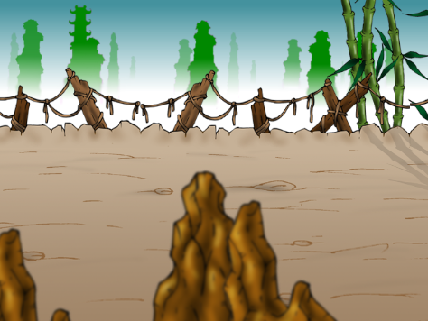

Stage
=====

El objeto Stage es uno de los componentes mas importantes
de la escena ``Game``, porque hace dos tareas: Imprime
el escenario simulando un scroll horizontal y a la vez
administra las colisiones con un objeto interno llamado
CollisionManager

.. note::

    Podés ver en funcionamiento el módulo ``stage.py`` aislado
    si ejecutás ``python stage.py`` desde el directorio ``sfbury``.
